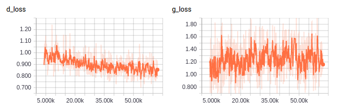
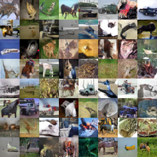

# tf-SNDCGAN
Tensorflow implementation of the paper "Spectral Normalization for Generative Adversarial Networks"
(https://www.researchgate.net/publication/318572189_Spectral_Normalization_for_Generative_Adversarial_Networks,
 ICML 2017)

The implementation is based on the author's original code at:
https://github.com/pfnet-research/chainer-gan-lib

This implementation works for tensorflow default data format "NHWC"

# Spectral Normalization for Generative Adversarial Networks:
This method enforces Lipschitz-1 condition on the Discrminator of Wasserstein-GAN
by normalizing its weight matrices with their own respective maximum singular value.
This can be used together with Gradient Penalty in the paper "Improved Training
of Wasserstein GAN".

The author uses a fast approximation method to compute the maximum singular value
of weight matrices.

# How to use spectral normalization:

    from libs.sn import spectral_normed_weight
    # Create weight variable
    W = tf.Variable(np.random.normal(size=[784, 10], scale=0.02), name='W', dtype=tf.float32)
    # name of tf collection used for storing the update ops (u)
    SPECTRAL_NORM_UPDATE_OPS = "spectral_norm_update_ops"
    # call wrapping function, W_bar will be the spectral normed weight matrix
    W_bar = spectral_normed_weight(W, num_iters=1, update_collection=SPECTRAL_NORM_UPDATE_OPS)
    ...
    # During training, run the update ops at the end of the iteration
    for iter in range(max_iters):
        # Training goes here
        ...
        # Update ops at the end
        for update_op in update_ops:
            sess.run(update_op)

For an example, see the file [test_sn_implementation.py](test_sn_implementation.py)

# Training curve:
At around 60k iteration:

# Generated image samples on Cifar10:
At 60k iteration:

# Inception score:
Tested inception score at 60k iteration is: **7.05**. The reported inception
score in the original repository is **7.41** at 100k iteration.
# Issues:
- GPU under-utilization: The original implementation of the author in chainer
uses 80%+ GPU most of the time. On an NVIDIA GTX 1080TI, their implementation
run at nearly 3 iterations/s. This implementation use less than 50% GPU and
run at less than 2 iterations/s.

- No Fréchet Inception Distance (https://arxiv.org/abs/1706.08500) evaluation yet.